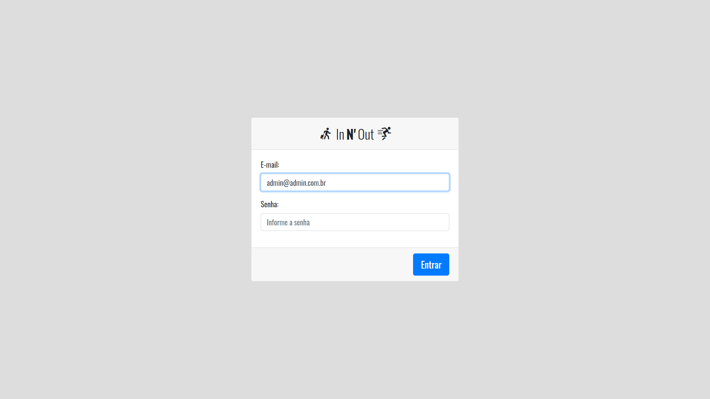

# Innout
<p align="center"> 🚀 Sistema de registro de entrada e saída de funcionários feito em PHP</p>

<p align="center">
 <a href="#objetivo">Objetivo</a> •
 <a href="#tecnologias">Tecnologias</a> • 
 <a href="#licenc-a">Licença</a> • 
 <a href="#autor">Autor</a>
</p>

<div id="objetivo">
 <h2>Objetivo</h2>
<h5>Automatizar o registro de entrada e saída de funcionários de uma empresa, como relatórios mensais, horas extras, faltas e etc.<h5>
 </div>
 
 <div id="tecnologias">
 <h2>🛠Tecnologias</h2>
  <h5>PHP<h5>
  <h5>MySql<h5>
  <h5>Bootstrap<h5>
 </div>
   
  <div id="licenc-a">
   <h2>Licença</h2>
    <h5>MIT<h5>
  </div>
     
   <div id="autor">
   <h2>Autor</h2>
    <h5>João Paulo Vieira<h5>
  </div>
     
 <h4> 
	🚧  PHP Select 🚀 Em construção...  🚧
</h4>

### Features

- [x] Login do usuário
- [x] Cadastro de usuários
- [ ] Cadastro de funcionários

<h1 align="center">
  
</h1>

## Pré-requisitos

Antes de começar, você vai precisar ter instalado em sua máquina as seguintes ferramentas:
[MAMP],  Além disto é bom ter um editor para trabalhar com o código como [VSCode](https://code.visualstudio.com/)

### 🎲 Rodando o Back End (servidor)

```bash

# Acesse o MAMP

# Configure seu MySql Local

# Configure o arquivo env.ini com as configurações locais do seu servidor mysql, como o host, user, password e database

```

### Autor
---

 

 <b>João Paulo Vieira</b>🚀
 
  
  
Feito com ❤️ por João Paulo Vieira 👋🏽

